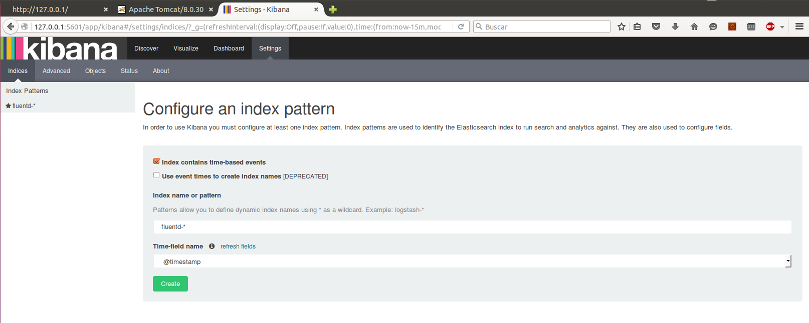
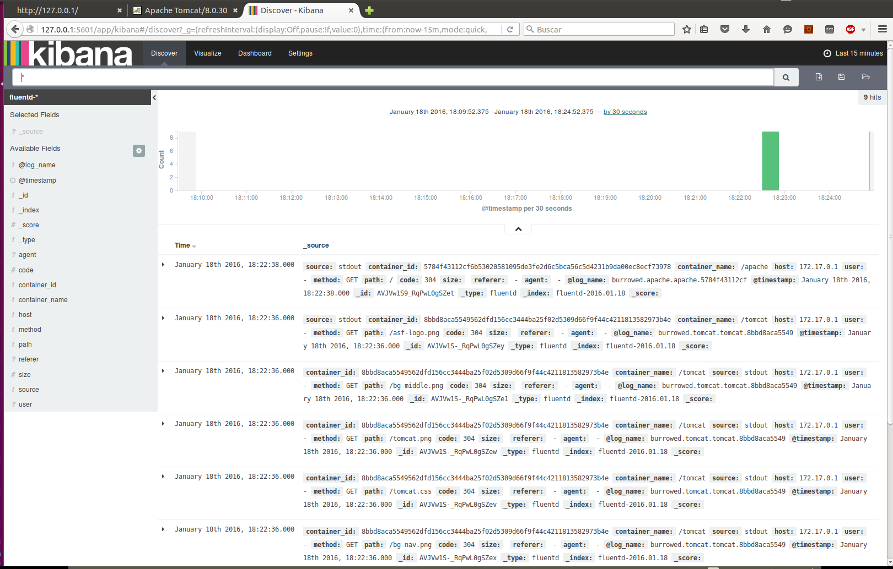

# Monitoring with Kibana, Elasticsearch, Fluentd and Fluentd-forwarding
###CloudOpting machine
####1) Deploy monitor.yml in CloudOpting machine
    cd coco
    docker-compose -f monitor.yml up
monitor.yml deploys three containers, fluentd (port 24224), elasticsearch and kibana (port 5601)
fluentd uses a ssl connection

**Notes:**
- You can change the path to certificates in /coco/fluentd/monitor.yml
- You can change the names of certificates, shared key and passphrase in /coco/fluentd/volumes/etc/cloudopting.conf
- You can add filters in coco/fluentd/volumes/etc/filters. At this moment exist 2 filters (apache.conf and tomcat.conf)

####2) Add new services to fluentd

- You must print containers logs in stdout.
- You must add in your compose file (compose.yml):
       service:
         ...
         log_driver: "fluentd"
         log_opt:
           fluentd-address: "fluentd-forwarding:24223"
           fluentd-tag: "docker.application_name.{{.Name}}.{{.ID}}"
- You can add filters in coco/fluentd/volumes/etc/filters. At this moment exist 2 filters (apache.conf and tomcat.conf) that you can use as example.

###VM
####For CloudOpting-manager
- Manager must deploy fluentd-forwarding when he creates the VM or at least before deploying other containers.
-- He can use fluentd-forwarding.yml and fforwarding.pp

- CloudOpting IP should be replaced in fluentd-forwarding.yml:
      fluentd-forwarding:
        ...
        extra_hosts:
          - "CloudOpting:91.121.225.114"
- Manager must save the fluentd-forwarding IP in /etc/hosts of VM with name fluentd-forwarding. He can use:
        echo "$(docker inspect --format '{{ .NetworkSettings.Networks.bridge.IPAddress }}' fluentd-forwarding) fluentd-forwarding >> /etc/hosts

**Notes:**

- Manager can change the certificates path in fluentd-forwarding.yml
- Manager can change the names of certificates, shared key and passphrase in fforwarding.pp

###Accessing data

**_Kibana:_** 
- You can access to Kibana in CloudOpting_IP:5601.
- In settings use pattern fluentd-*

